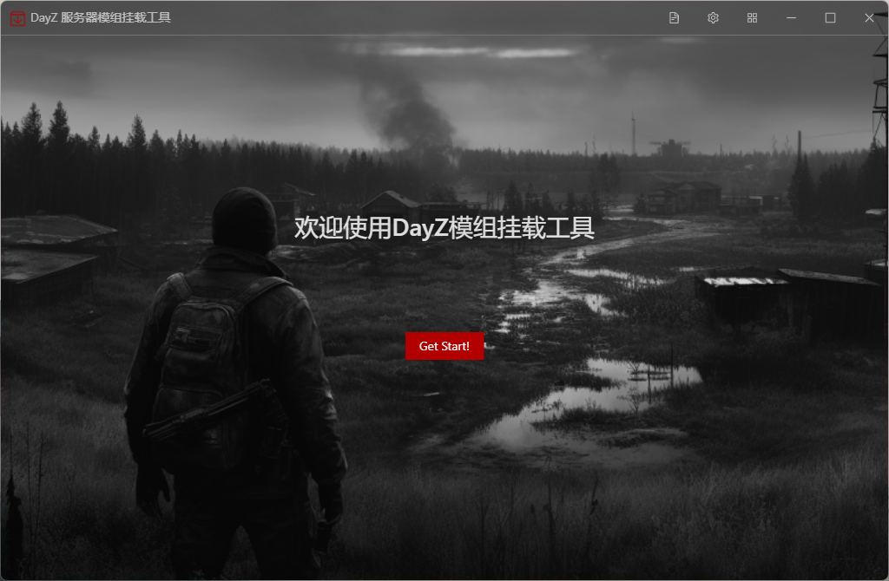
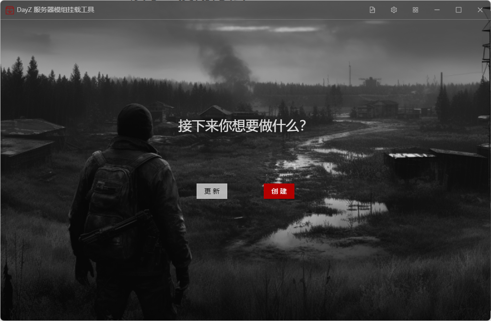

# DayZ Mod Setup Tool

此工具能够创建新服务器时挂载MDO或者给现有的服务器进行新MOD的挂载


# 展示&使用方法




更新：给现有服务器进行MOD添加（服务器最好是通过本工具创建的）

创建：创建新的DayZ服务器




本工具对dayzserver的配置文件列表，右击进行编辑或者删除


此状态为选中状态


服务器名称：字面意思

配置文件名称（备注）：就是备注，随便写

纯净服务器文件夹路径：指什么都没有编辑，就是直接从steam下载下来，什么都没动过的

创建服务器文件夹路径：指后面挂载好MOD的服务器放置的位置

部署服务器文件夹路径：指需要将配置好的服务器部署的位置，比如云服务器 <span style="color: red">此工具现在为beta版，最好先与创建服务器文件夹保持一致（当作本地单机服务器使用）</span>

预设文件：就是DayZ Lancher中保存好的MOD组合

服务器配置文件夹：指profile文件夹的位置


这里可以进行MOD的增加或者移除，右边表示即将挂载的MOD


## 环境依赖

在运行此项目之前，请确保系统安装了以下依赖：

- [Node.js](https://nodejs.org/) (版本 = 16.18.1)


## 安装步骤

1. 克隆仓库：
   ```bash
   git clone https://github.com/yowainaegi/dayz-mod-setup-tool.git
   cd dayz-mod-setup-tool
   ```

2. 安装依赖：

   ```bash
   npm install
   ```

3. 运行：

   ```bash
   npm run electron:serve
   ```

4. 然后即可使用


感谢您关注此项目，如果任何问题，请提issue（可以提建议也可以提交bug！）

如果对您有帮助，请帮忙点点start！
