# DayZ Mod Setup Tool


[日本語](README_ja.md)版

[English](README_en.md) Version


此工具能够创建新服务器时挂载MOD或者给现有的服务器进行新MOD的挂载


## 环境依赖

在运行此项目之前，请确保系统安装了以下依赖：

- [Node.js](https://nodejs.org/) (版本 = 16.18.1)
- Vue 3.3.0
- Sqlite3 5.0.2
- Electron 13.0.0
- typescript 5.0.3


## 安装步骤

1. 克隆仓库：
   ```bash
   git clone https://github.com/yowainaegi/dayz-mod-setup-tool.git
   cd dayz-mod-setup-tool
   ```

2. 安装依赖：

   ```bash
   npm install
   ```

3. 运行：

   ```bash
   npm run electron:serve
   ```

4. 然后即可使用

5. 打包：

   ```bash
   npm run electron:build
   ```

   


# 展示&使用方法

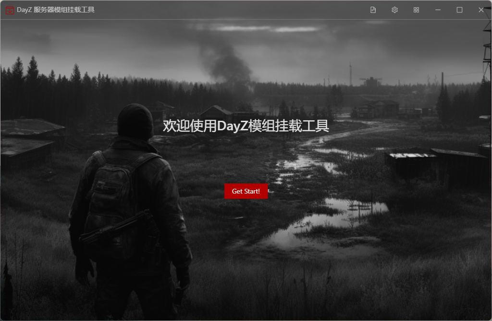


首先，确认您电脑上安装了DayZ，确保此工具能够正常运行

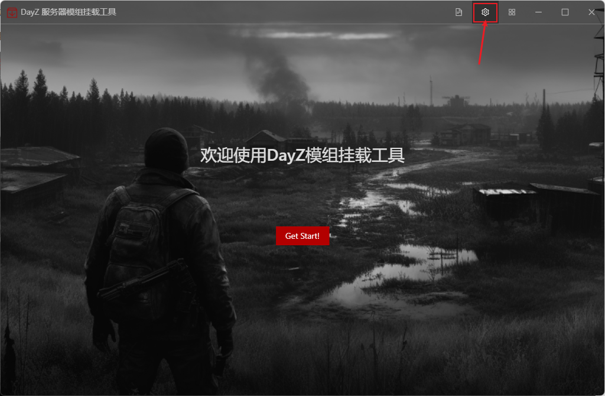

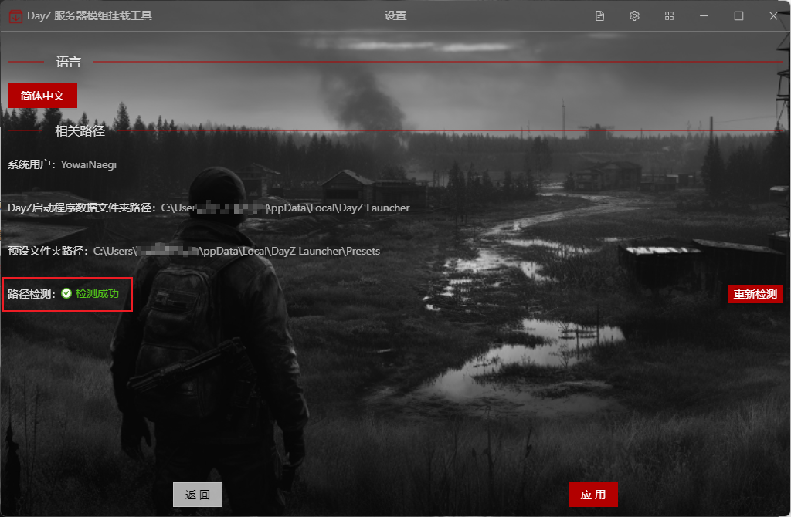


更新：给现有服务器进行MOD添加（服务器最好是通过此工具创建的）

创建：创建新的DayZ服务器

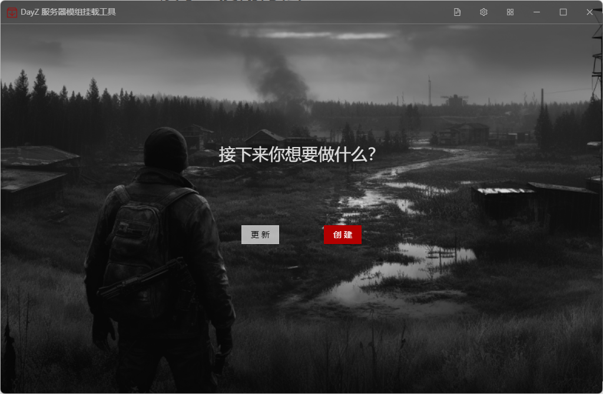

此工具对dayzserver的配置文件列表，右击进行编辑或者删除

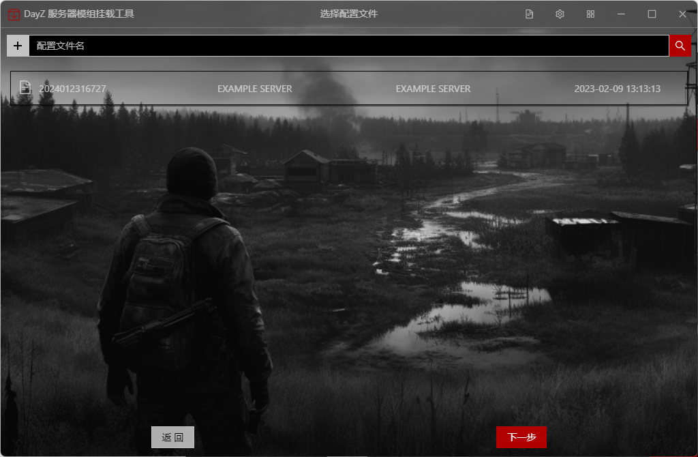


此状态为选中状态

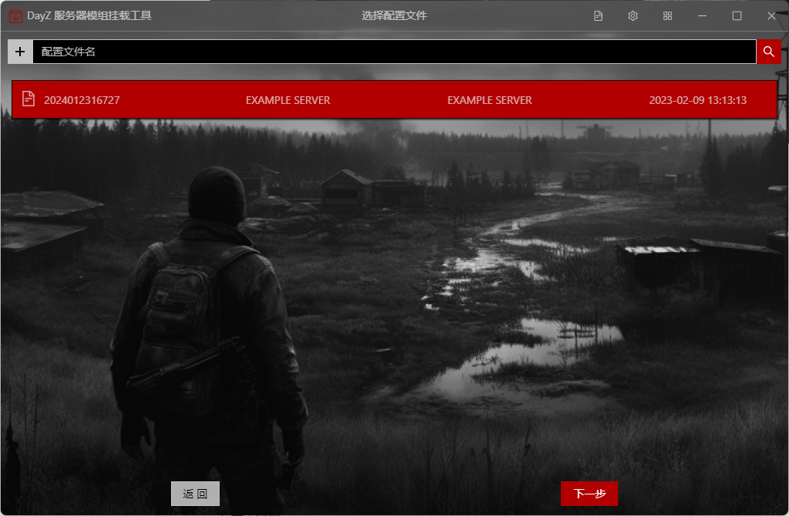


服务器名称：字面意思

配置文件名称（备注）：就是备注，随便写

纯净服务器文件夹路径：指什么都没有编辑，就是直接从steam下载下来，什么都没动过的

创建服务器文件夹路径：指后面挂载好MOD的服务器放置的位置

部署服务器文件夹路径：指需要将配置好的服务器部署的位置，比如云服务器 <span style="color: red">此工具现在为beta版，最好先与创建服务器文件夹保持一致（当作本地单机服务器使用）</span>

预设文件：就是DayZ Lancher中保存好的MOD组合

服务器配置文件夹：指profile文件夹的位置

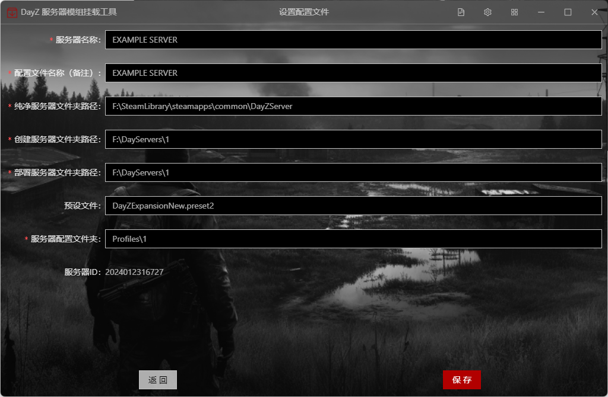


这里可以进行MOD的增加或者移除，右边表示即将挂载的MOD <span style="color: red">此工具现在为beta版，最好先在DayZ Lancher中配置好在这里不要改动，直接创建</span>

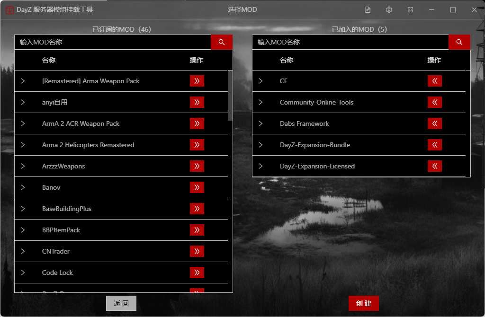


创建进度

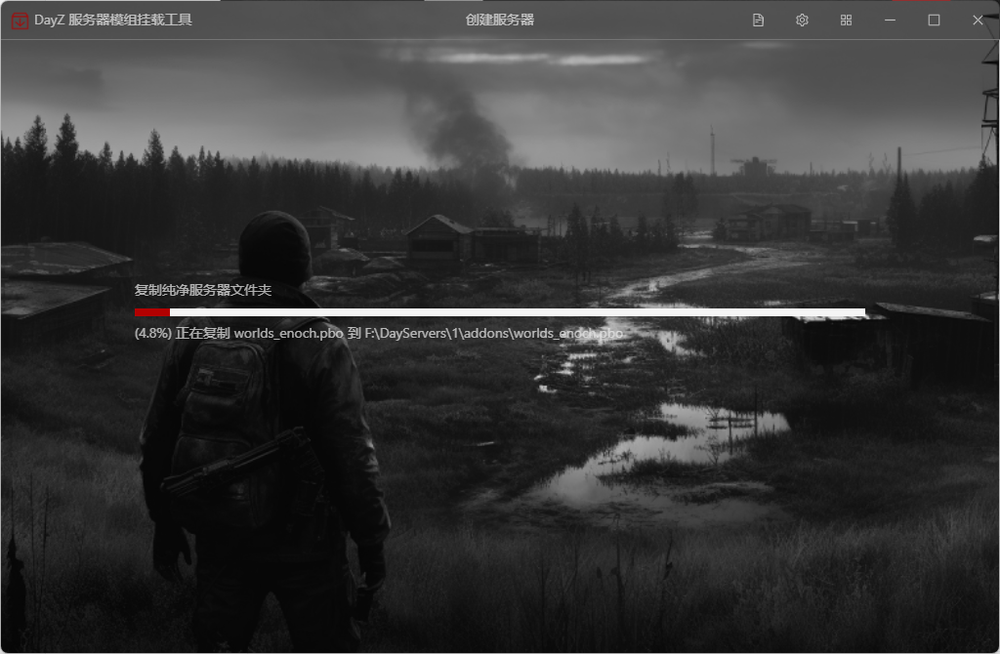


下面是此工具操作过的文件


自动更改的`startup.bat`

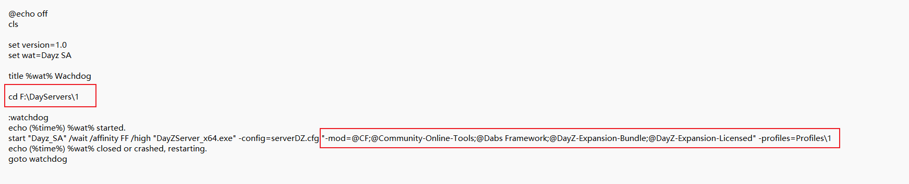


以及自动更改的`serverDZ.cfg`

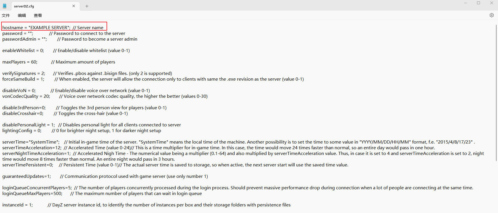


创建完成后，您可以点击创建好的dayzserver根目录下`startup.bat`运行DayZServer服务器


# 提交问题或者反应bug

如果报错框关掉了，可以点这里截图或者复制反应bug

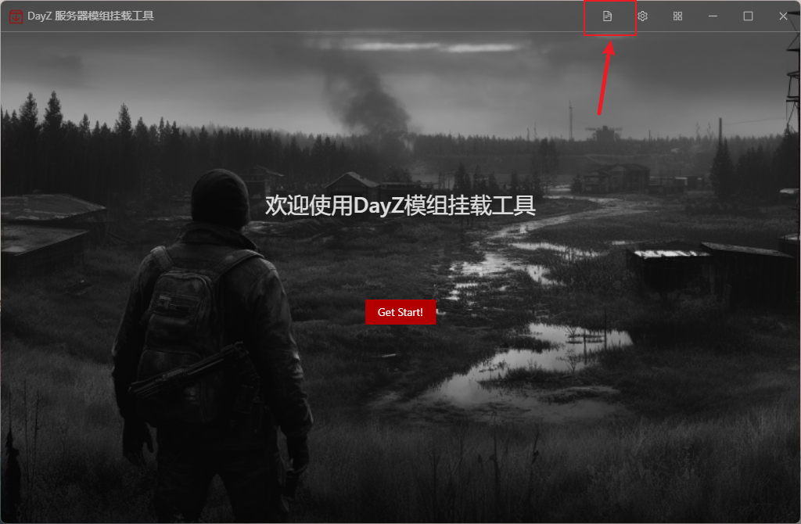

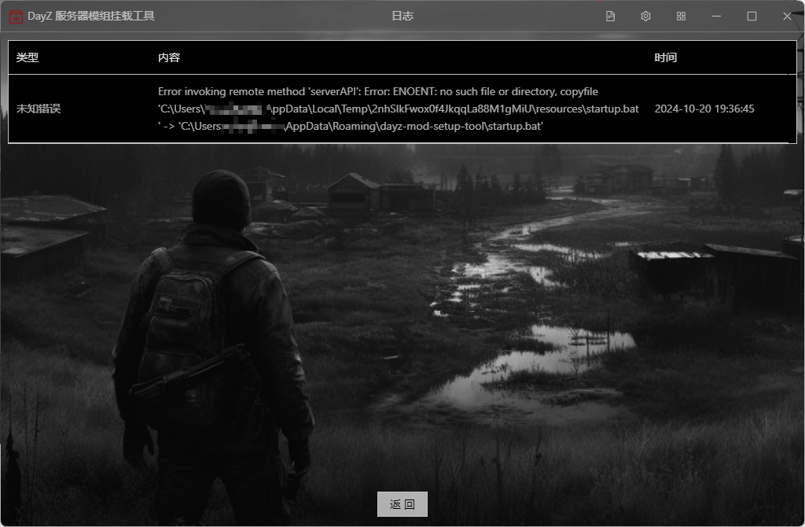


最后，感谢您关注此项目，如果任何问题，请提issue（可以提建议也可以提交bug！）

如果对您有帮助，请帮忙点点start！
