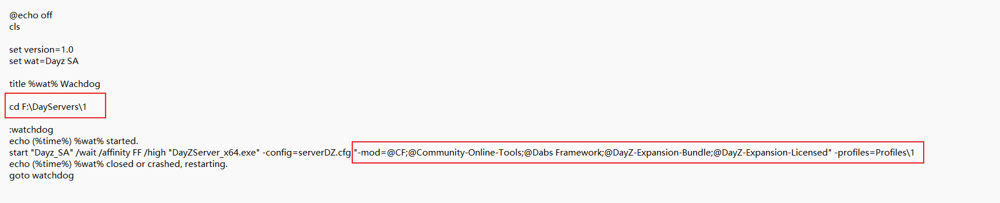
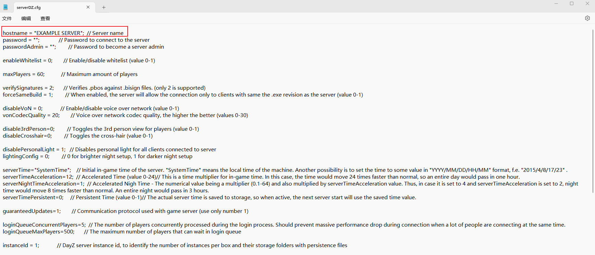
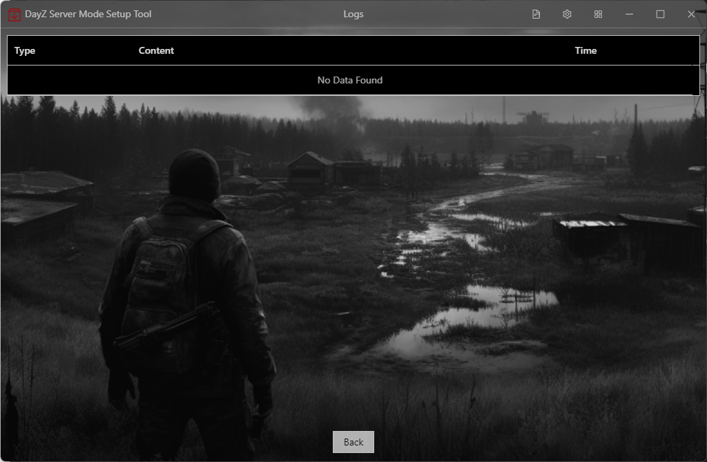

# DayZ Mod Setup Tool


[中文](README.md)版

[日本語](README_ja.md)版


This tool can mount MOD when creating a new server or mount a new MOD to an existing server


## Dependencies

Before running this project, please ensure that the following dependencies are installed on the system:

- [Node.js](https://nodejs.org/) (version = 16.18.1)
- Vue 3.3.0
- Sqlite3 5.0.2
- Electron 13.0.0
- typescript 5.0.3


## Installation steps

1. Clone repository：
   ```bash
   git clone https://github.com/yowainaegi/dayz-mod-setup-tool.git
   cd dayz-mod-setup-tool
   ```

2. Install dependencies：

   ```bash
   npm install
   ```

3. run：

   ```bash
   npm run electron:serve
   ```

5. package：

   ```bash
   npm run electron:build
   ```

   

## Display&Usage


Firstly, confirm that DayZ is installed on your computer and ensure that this tool is functioning properly


Update: Add MOD to existing servers (preferably created using this tool)

Create: Create a new DayZ server


The config file for this tool, You can edit it by right click


And now is selected when you click it


Server Name: Just the server name what you wanted

Configuration File Name (Remark): Just a remark, feel free to write anything

Pure Server Folder Path: Refers to the folder downloaded directly from Steam without any modifications

Created Server Folder Path: Refers to the location where the server with mounted mods is placed

Deployed Server Folder Path: Refers to the location where the configured server will be deployed, such as a cloud server <span style="color: red">This tool is currently in beta. It's best to keep this path the same as the Created Server Folder Path for now (treat it as a local single-player server)</span>

Preset File: Refers to the MOD combination saved in the DayZ Launcher

Server Configuration Folder: Refers to the location of the profile folder


Here you can add or remove MODs, and the right side shows the MODs to be mounted. <span style="color: red">This tool is currently in beta. It's best to configure everything in the DayZ Launcher first and avoid making changes here. Just proceed with creation.</span>


Creating


Below are the files that have been modified by this tool.


Automatically modified sections of `startup.bat`




Automatically modified sections of `serverDZ.cfg`




After the creation is complete, you can click on `startup.bat` in the root directory of the created DayZ server to run the DayZServer.


## Submit issues or report bugs

If the error message box has closed, you can click here to take a screenshot or copy the bug report.





Finally, thank you for your attention to this project. If you have any issues, please submit an issue (you can suggest improvements or report bugs!).

If you find it helpful, please don't forget to give it a star!


## License

Copyright (c) 2024 YowaiNaegi

Licensed under the [MIT](https://github.com/microsoft/vscode/blob/main/LICENSE.txt) license.
