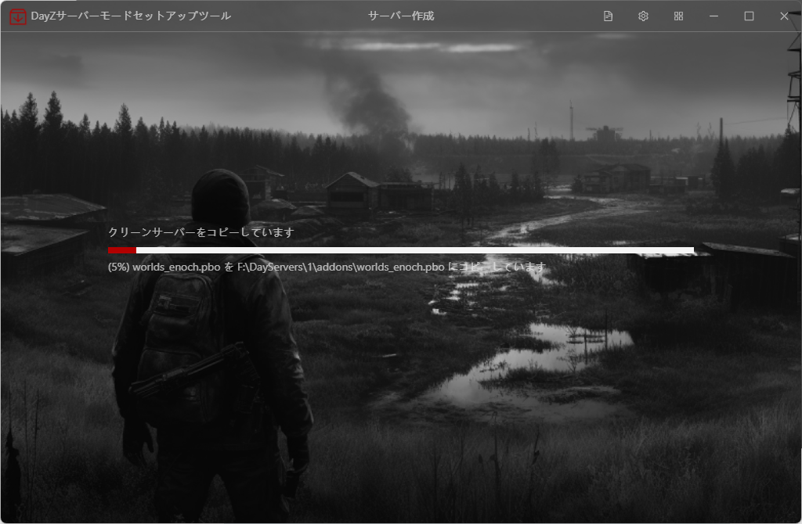
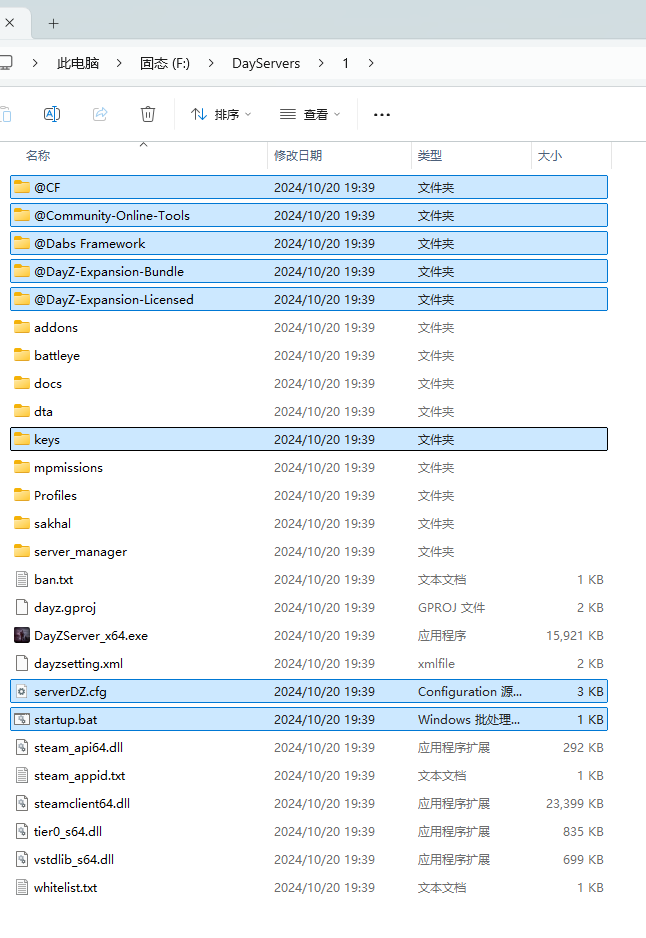

# DayZ Mod Setup Tool


[中文](README.md)版

[English](README_en.md) Version


このツールはサーバーを新規作成するときモードを追加する、あるいは既存サーバーにモードを追加することができます。


## 開発環境

このプロジェクトを実行する前に、下記の環境が存在することっ確認してください。

- [Node.js](https://nodejs.org/) (バージョン = 16.18.1)
- Vue 3.3.0
- Sqlite3 5.0.2
- Electron 13.0.0
- typescript 5.0.3


## インストールステップ

1. レポジトリをクローン：
   ```bash
   git clone https://github.com/yowainaegi/dayz-mod-setup-tool.git
   cd dayz-mod-setup-tool
   ```

2. 依存関係をインストール：

   ```bash
   npm install
   ```

3. 起動：

   ```bash
   npm run electron:serve
   ```

5. パッケージ：

   ```bash
   npm run electron:build
   ```

   


# 使用方法


まずは、あなたのPCにDayZがインストールされていることを確認してください


更新：既存サーバーにMODをついかする（既存サーバーもこのツールで作成したサーバーの方がお勧めします）

新規：新しいサーバーを作成する


このツールに対するサーバーの設定ファイルリスト、右クリックしてから編集、削除することができます


以下の状態は選択されている状態です


サーバー名：サーバーの名前

設定ファイル名：マーク文、なにを書いても大丈夫です

クリーンサーバーパス：SteamからダウンロードしたDayZServerのパスです、何も触ったことがないサーバーのパスです

新規サーバーパス：新規作成したサーバーのパス、つまり、新規サーバーの置きたい箇所

デプロイサーバーパス: 設定済みのサーバーを展開する位置を指します。例えば、クラウドサーバーに置きたい方がここをクラウドPCの箇所指定してください <span style="color: red">このツールは現在ベータ版であり、まずはローカルの単一マシンサーバーとして使用するために、サーバーフォルダの作成と一致させることが最善です。</span>

プリセットファイル名：DayZ Lancher中に保存されたMODグループです

プロファイルパス：サーバーのプロファイルの箇所、例：`Profiles\1`の場合、`F:\DayServer\1\Profiles\1`フォルダーを作成します。


ここではMODの追加または削除を行うことができます。右側には追加予定のMODが表示されます。<span style="color: red">このツールは現在ベータ版であるため、まずはDayZ Lancherで設定を完了させてからこちらでは変更せずに直接作成することをお勧めします。</span>


作成中




以下はこのツールが操作したところです



自動的に`startup.bat`を編集


自動的に`serverDZ.cfg`を編集


作成完了後、サーバーrootフォルダーに`startup.bat`でサーバーを起動する


# 問題を報告するまたはバグをフィードバックする

如果报错框关掉了，可以点这里截图或者复制反应bug

エラーメッセージダイアログが閉じた場合、ここでスクリーンショットをしたり、バグを報告するためにコピーしたりできます。


最後に、このプロジェクトに関心を持っていただきありがとうございます。何か問題がありましたら、 ISSUE を提出してください（提案やバグの報告も歓迎です！）。

もし役立ったと思われましたら、スターを押してサポートをお願いします！


